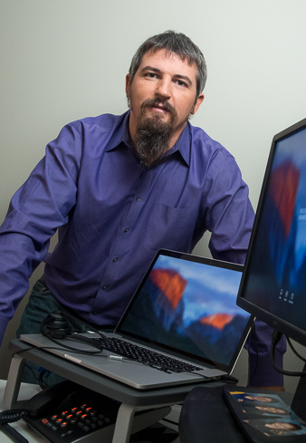

### Brody Sisson

Team role: builder, driver  
Years in FIRST: This is my FIRST year in first.  Wait.  Strike that.  Swap it.  
Age: 14  
Grade: 9  
Favorite food:  Burritos  

Brody has never done robotics until now.  Mainly he joined cuz a lot of his friends were on the team, but he has always liked to build things.  He enjoys watching movies, mountain biking, skiing, surfing, and video games.  (Don't we all?)

 

### Gabriel Fergesen 

Team role: Coder  
Years in FIRST: This is my FIRST year (uwu)  
Age: 14  
Favorite food: everything, but I hate tomatoes and condiments, and LOVE asian/big juicy steaks/Indian food.  

Gabriel didn't think he'd ever end up on a FIRST team, but here he is, and he'll make the best of it (although he's a little nervous). He has repeatedly dabbled in code, Neural Networks, and Python ever since his science fair project in 7th Grade. He just wants to know enough code to make odd things involving art, 3D printing, and social game design, but has ended up writing a novel, *Tales of Atlantis Six Vol. 1*, building robots, and a variety of other activities. Woe be to the person who questions Gabriel Fergesen about Portal, books, or Ingress Prime, as he loves to talk about his fandoms. (yes, he is indeed a nerd.)

 

### Hunter Wagenseller

Team role: Coder, Builder  
Years in FIRST: 1  
Age: 14  
Grade: 8th   
Favorite food: Steak  

As I participate in FTC I also like to do many other things in my spare time including Boy Scouts, Airsoft, Basketball, riding ATV's, Tubing, Going to bike parks, Gaming, and Legos. I have 1 dog, a hamster, and 3 chickens. I have 3 other siblings, and my Dad owns a Security company. I hope to continue on the team (Brain stormz) It is a fun activity that I want to stay in.

 

### James Penrose

Team role: Team Lead, Coder, Builder  
Years in FIRST: 4  
Age: 16  
Grade: 9th  
Favorite food: Korean BBQ  

James has done FLL for two years on team 32221 Thunder Chickens as a programmer and builder, the team went to LA regionals twice and won a programming award and numerous design awards. He is excited to now start FTC. He enjoys doing kickboxing and Brazilian Ju-Jitsu. He is learning to be a Programmer and Robot designer. Check him out at his Linkedin profile: [James Penrose on LinkedIn](https://www.linkedin.com/in/james-penrose-b23a1a22b/)

 

### Luke Schrodi

Team role: Builder, robot designer  
Year in FIRST: 4  
Grade: 10  
Age: 16  
Favorite Food: Not salad ;)  

Luke was on the FLL team Thunder Chickens #32221 for 3 years. During his time at FLL, Luke had a chance to design and build the entire core chasis for one of their bots as well as helping with building many mission-fulfilling attachements. His team made it to regionals two years in a row, and nearly qualified for worlds. He is thrilled to be building attachments for his FTC team. He enjoys nerding on people in Fortnite and shredding local trails with his friends on his mountain bike. He also has two custom built RC cars.

 

### Madeleine Schrodi

Team Role: PR manager, website builder, and fundraiser  
Years in FIRST: This is my first one!  
Age: 17  
Grade: 12th  
Favorite Food: All of the above :)  

While this is her first official year in FIRST, she has been involved through her brother (Luke Schrodi) for much longer than that. Her pre-official contributions include exciting things like desinging the team-logo for the Thunder Chickens or being a ref at an FLL regional competition. She also did the small things like bringing donuts to scrimmages, helping team member's with their project scripts, or making sure that every moment was captured with pictures and videos. Madeleine is thrilled to finally be an official team member and is excited to see what this year will hold.

 

### Peter Zagnoli

Team role: Builder  
Years in FIRST: 3  
Age: 14  
Favorite food: American Food ie fried stuff  

Peter had been in FLL for two seasons as a part of (then) rookie team, Thunder Chickens and is starting his first year in FTC. In his own words, he "was amazing at every thing in FLL and will be in FTC". While he said that completely jokingly (as it was farrrr from the truth), it speaks to his motivation and drive to excel in this new competition. Other than robotics, he enjoys flying 5th scale, which is super huge, RC planes.   

 

### Teague Shepard

Team Role: Builder  
Years in FIRST: 3    
Age: 15  
Grade: 9th  
Favorite Food: Sushi  

There's nothing interesting about this duuude.

 

### Garrett Smalley

Team role: Mentor  
Years in FIRST: 17  
Age: 27  

Garret is a mechanical engineer, and mentors us in mechanical design, fabrication, and CAD.  

 

  
### Jacob Newman

Team role: Building and programming mentor  
Years in FIRST: 4  
Age: 20  
Favorite food: Soy yogurt  
  
Jacob is a Nerd/Geek (he hasn't figured out which one yet) who has been interested in technology his entire life. This is his 5rd year involved with a FIRST team. When not working on robots or robot code, Jacob enjoys playing/contributing to/telling people about SuperTuxKart way too much.  

 

  
### Jeff DeVico

Team role: Coach  
Years in FIRST: 5  
Age: 51  
Favorite food: Fondue  

Jeff has been coaching in FIRST for five years, and this is his third year coaching an FTC team. Jeff has been the owner of a growing automated shipping business for the past 11 years. He graduated college with a bachelor's degree in architecture from Cal Poly. Jeff is a proud husband and father of three kids at 18, 16, and 12 years old. He has a strong background in sales marketing, fundraising, and business planning. Jeff is excited to be coaching Brain Stormz and looks forward to their future success.  

 

### Nathan Michael Choi

Team role: Robot Design/Building, Programming, Rulebook Clarifier  
Years in FIRST: 7  
Age: 18  
Grade: 12th  
Favorite food: Shin Ramen  

Nathan Choi is a 16 year nerd who goes to Trinity Pacific School and is in his 6th year of FIRST competitions and 5th year of FTC. He was a member of FTC Trinity Crown Bots when he was a 6th grader. After that, he joined the FLL team, The B.E.S.T. Team. Nathan enjoys reading, playing with Legos, and playing video games. He is excited for Rover Ruckus, and is ready for a great season.  

 

### Noah Jeffery DeVico

Team role: Robot Design/Building, Driver, CAD  
Years in FIRST: 7  
Age: 18  
Grade: 12th  
Favorite food: Burgers  

Noah has been involved in FIRST programs since 2013. This is Noah's fourth year on a FTC team, having completed two years prior of FLL with The B.E.S.T Team and being a founding member of the FTC team Brain Stormz. Noah is part of Trinity Pacific Christian School, which is a private school in Thousand Oaks, California. He is heavily involved in basketball at his school having played since he was ten. In his free time he likes to play his collection of vintage video games including a Sega Genesis and a Nintendo Entertainment System. Noah has liked Engineering since he was little having been a fan of Lego/Mindstorms since he was 7.  

 

### Stu Penrose

Team role: Head Coach
Years in FIRST: 3
Favorite Food: saganaki

A life-long hardware & software engineering enthusiast with a passion for teaching, Stu has worked as a product & software engineering leader in a variety of large-scale internet companies over the past 20 years.  When he's not coding or hanging out with Brain Stormz, you'll find him flying, sailing, or hanging out with his wife and 4 kids.
Learn more about Stu at stu.penrose.us

 

  
### Sung Choi

Team role: Coach  
Years in FIRST: 6  
Age: 50  
Favorite food: Asian Confusion  

Sung has coached FIRST teams since FTC Block Party. Sung has been a software/systems engineer for over 20 years in various industries. He has a Masters degree from USC in Electrical Engineering. He is a loving husband and father of 2 children. Sung has a strong background in Software, Systems Design and Electrical Engineering.
