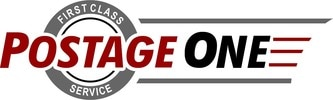

# Our Robot - 2017-18 Relic Recovery Season:

This season, our approach to designing our robot has changed. Last season, we noticed that many interesting, potentially high scoring designs that we prototyped never made it on the robot, such as a cap ball lifter and an improved, spring loaded shooter. We found the reason was because we were too focused on getting the robot working now rather than thinking towards what are robot should look like in the future. Because of this, our engineering process this season started out with prototyping every possible mechanism so we didn't need to leave any point scoring elements off our robot later in the season.  Our strategy was to be as offensive as possible, as defense didn't look like a viable option, given the extremely reduced and sectioned space in this year's challenge. Compatibility, which was a large part of last year's game, was a low priority as well, as no missions in autonomous or TeleOp required both alliance partners to work well with each other to succeed. This in mind, we set out to make a robot that could be effective while alone, and help an alliance partner, too.

With our strategy decided upon, we shifted towards prototyping three key scoring elements: a glyph delivery system, a glyph collector, and a stable drive train.

Our initial drive train was a 6-wheel tank drive utilizing Rev's extrusion mounting system, which gave us a lightweight and customizable base for our robot.

After brainstoming couple ideas for a delivery mechanism, we decided on a conveyor system that could extend to deliver glyphs from a distance, giving us a significant time advantage when compared to a claw delivery system.

# Our Story - 2017-18 Relic Recovery Season:

When September finally came around, the team was super excited. They were about to embark on another year of FTC and have another set of challenges to overcome. What could be better? After waiting in expectation all summer, Relic Recovery's reveal was a huge treat and the team immediately started brainstorming ways to approach it. Someone suggested we use something like a conveyor belt to move the glyphs from one side of the robot to the other, an idea that met with much approval. Further expanding this idea, we thought that it might be more efficient if we could just extend this conveyor belt from our robot to the cryptobox in order to place the glyphs directly where they need to go. We quickly found that we could easily use the drawer slides from last year's cap ball mechanism to work as an extending conveyor belt by simply stringing taut surgical tubing parallel to the slides between two axles controlled by a motor. However, this was still in the prototype phase when League Meet 0 approached, so we constructed a simple robot with a jewel arm and two glyph grabbers, one that only moves vertically, and another, also known as the "slam dunk claw", that pivoted in the middle, allowing it to reach both sides of our robot. With the addition of an autonomous program and driving practice, we did quite well at this first meet, in spite of our simplistic design and a few problems.

Meet 1 soon followed, as did much improvement. We rebuilt our slam dunk claw so that it could hold two glyphs and spin them, in order to grab and deposit glyphs most efficiently. In addition, we realized that this claw worked much better at transporting glyphs over our robot than the clumsy prototype of a conveyor belt we had been working on, so we decided to continue using that and drop the conveyor idea. However, our prototyping was not over there; the relic arm remained. Thus, we redirected our focus to the creation of that mechanism, while still improving the claw arm. We have tried to make similar linear slide systems for three years now, so this year we were able to build off of our previous experiences to begin this mechanism.

While this was going on, we were simultaneously developing our next chassis in CAD. We took this design to some professionals who graciously reviewed them and made some suggestions, which we gratefully accepted. This new chassis uses Mecanum wheels, allowing us to move in any direction without turning. It will also have room for Jewel arms cut in the sides, as well as removable top plates with the standard hole pattern cut in for easy access to the chained drive motors.

Having all of these mechanisms still in development, we brought our new and improved claw to Meet 2, not sure of what to expect. Although our auto was a little rough, we ended up filling the first full Cryptobox in the region, exceeding everyone's (mostly ours) expectations! Our Christmas break was spent thinking of how amazing it was to fill that Crypto, and how we hope to do it again in Meet 3.

The main change on our robot from Meets 2-3 was the thinning of the claws on the arm to allow us to more easily place glyphs in the box. However, we were far from unproductive during this time; we finished both our Relic mechanism and our chassis. Neither of them were competition ready, so they didn't end up on the robot. Instead, we used what we knew and went back, actually scoring the regional high score at the time, and ending up at the end of the league meets ranked 1st.

After Meet 3, it was all hands on deck, full steam ahead on FutureBot, as this was the biggest gap of time between competitions that we would have for the rest of the season. The slam dunk arm was taken off of our old chassis and mounted onto the new, alongside our Relic mechanism. We also began working on a glyph intake mechanism that would facilitate the collection of glyphs into our claws using compliant wheels. We tested this mechanism at a scrimmage we hosted with several local teams, and found that it was shredding our glyphs, literally tearing them to pieces. We then made them flip down on plexiglass rods so that they would not tear the glyphs, and it was a huge improvement. Whereas before we were struggling to fill a Crypto without a pattern, we were now comfortably filling Cryptos with pattern consistently. We were prepared for ILTs, and ready to take the new competition by Stormz!

# Our Team - 2017-18 Relic Recovery Season:

### Jacob Newman

Team role: Building and programming mentor
Years in FIRST: 3
Age: 18
Grade: 12th
Favorite food: Soy yogurt

Jacob is a Nerd/Geek (he hasn't figured out which one yet) who has been interested in technology his entire life. This is his 3rd year on a FIRST team. He has his own computer repair business, Jacob's PC Tune-Up.  When not working on robots or robot code, Jacob enjoys playing/contributing to/telling people about SuperTuxKart way too much. He is a senior homeschooler.

  
### Jeff DeVico

Team role: Coach
Years in FIRST: 5
Age: 51
Favorite food: Fondue

Jeff has been coaching in FIRST for five years, and this is his third year coaching an FTC team. Jeff has been the owner of a growing automated shipping business for the past 11 years. He graduated college with a bachelor's degree in architecture from Cal Poly. Jeff is a proud husband and father of three kids at 18, 16, and 12 years old. He has a strong background in sales marketing, fundraising, and business planning. Jeff is excited to be coaching Brain Stormz and looks forward to their future success.

  
### Sung Choi

Team role: Coach
Years in FIRST: 6
Age: 49
Favorite food: Asian Confusion

Sung has coached FIRST teams since FTC Block Party. Sung has been a software/systems engineer for over 20 years in various industries. He has a Masters degree from USC in Electrical Engineering. He is a loving husband and father of 2 children. Sung has a strong background in Software, Systems Design and Electrical Engineering.

  
### Daniel Peace

Team role: Mentor
Years in FIRST: 4
Age: 19
Favorite food: Fish and Chips

Daniel Peace is 19 years old and has always been interested in robotics and machines. This is his fourth year in First Tech Challenge. He was one of Brain Stormz's founding members, and is now a mentor. When not helping with robots he enjoys playing basketball and volleyball, and he also plays piano.

  
### Noah Jeffery DeVico

Team role: Robot Design/Building, Driver, CAD
Years in FIRST: 7
Age: 18
Grade: 12th
Favorite food: Burgers

Noah has been involved in FIRST programs since 2013. This is Noah's fourth year on a FTC team, having completed two years prior of FLL with The B.E.S.T Team and being a founding member of the FTC team Brain Stormz. Noah is part of Trinity Pacific Christian School, which is a private school in Thousand Oaks, California. He is heavily involved in basketball at his school having played since he was ten. In his free time he likes to play his collection of vintage video games including a Sega Genesis and a Nintendo Entertainment System. Noah has liked Engineering since he was little having been a fan of Lego/Mindstorms since he was 7.

  
### Nathan Michael Choi

Team role: Robot Design/Building, Programming, Rulebook Clarifier
Years in FIRST: 7
Age: 18
Grade: 12th
Favorite food: Shin Ramen

Nathan Choi is a 16 year nerd who goes to Trinity Pacific School and is in his 6th year of FIRST competitions and 5th year of FTC. He was a member of FTC Trinity Crown Bots when he was a 6th grader. After that, he joined the FLL team, The B.E.S.T. Team. Nathan enjoys reading, playing with Legos, and playing video games. He is excited for Rover Ruckus, and is ready for a great season.

  
### David Modrovich

Team role: Funding Administrator
Years in FIRST: 4
Age: 17
Grade: 12th
Favorite food: Enchiladas

David is a senior at Trinity Pacific High School. He has been interested in FIRST ever since 8th grade, when he was a part of a FLL team with some other members of Brain Stormz. He is aspiring to become a District Attorney when he grows up, and perhaps pursue a career in politics from there. Also, he loves to debate and to participate in Mock Trial.

  
### Joshua Soto

Team role: Robot Builder and Driver Coach
Years in FIRST: 2
Age: 14
Grade: 9th
Favorite food: Burritos

Joshua is a freshman who attends Trinity Pacific Christian School. He became interested in FIRST when he attended a match as a guest with the 2015-2016 Brain Stormz team. He is currently on the Trinity Pacific basketball and volleyball team.

  
### Olivia Choi

Team role: Media and Promotion
Years in FIRST: 1
Age: 13
Grade: 8th
Favorite food: BBQ

Olivia is an 8th grader in Trinity Pacific Christian School. Outside of FTC, she loves to play volleyball on her school and club team, sketch, read, and listen to music. This is her 1st year on a FIRST team.

  
### Kimberly Sharp

Team role: Robot Design/Builder
Years in FIRST: 4
Age: 17
Grade: 12th
Favorite food: Apple dumplings!

Kimberly Sharp truly enjoys being on team Brain Stormz. She has been a part of FLL team B.E.S.T. team for two years before this and really loved it. However, in her 10th grade year she feared she had too large of a school load to take on the extra challenge of FTC, deciding not to be on the team. Last year, she came back, not because of a lighter school load, but because she missed it so much she is willing to risk overload in order to be on such a great team as Brain Stormz. She knows from experience that it is well worth it.

# Our Sponsors - 2017-18 Relic Recovery Season:

<h3>Scott Family Foundation</h3>

