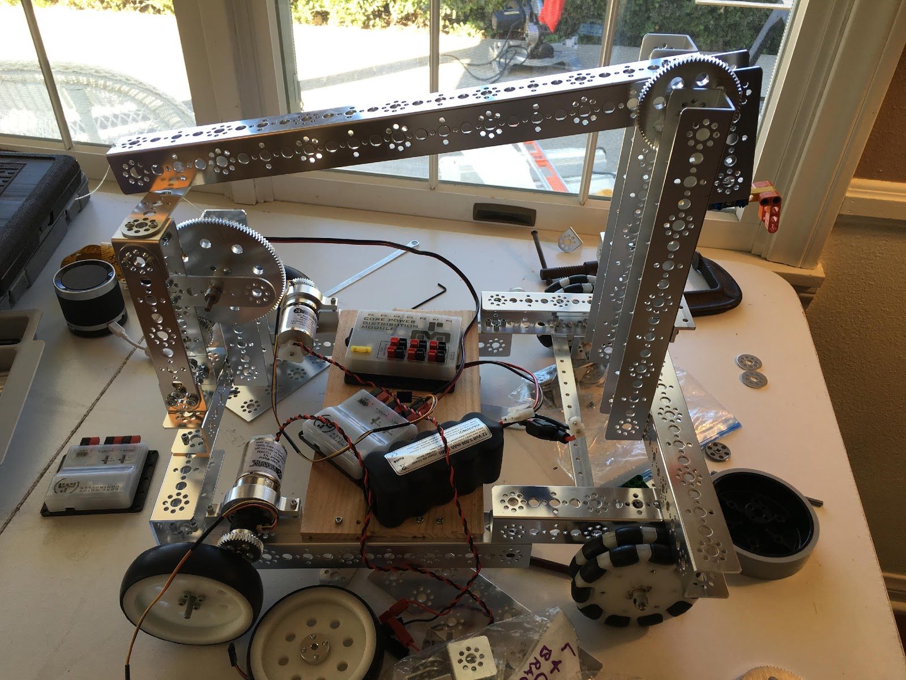
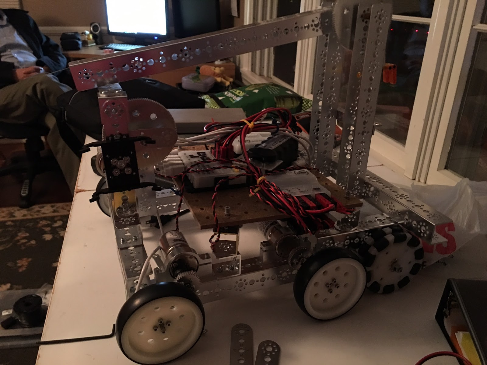
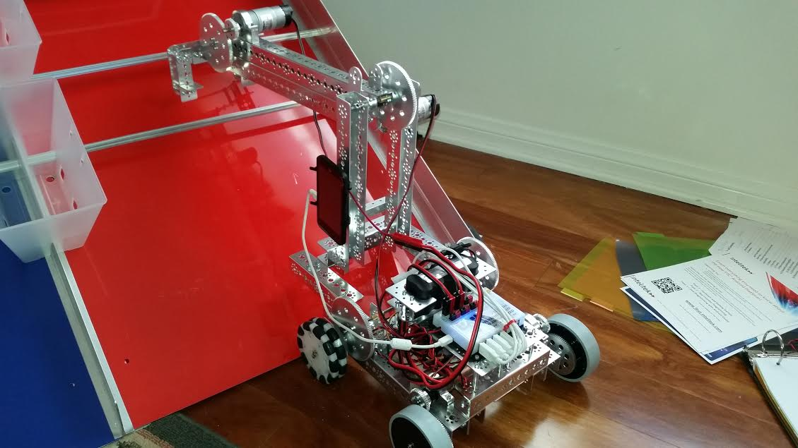
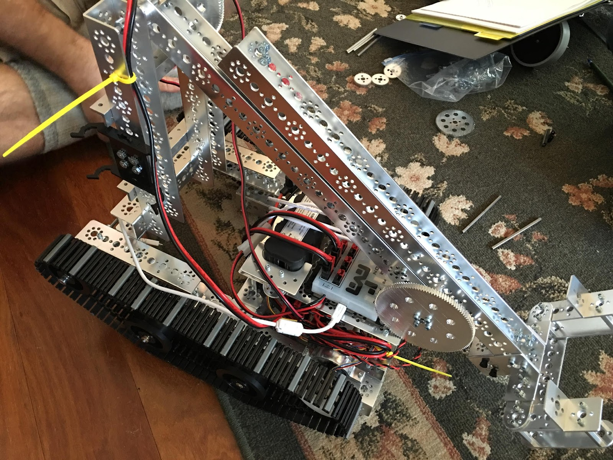
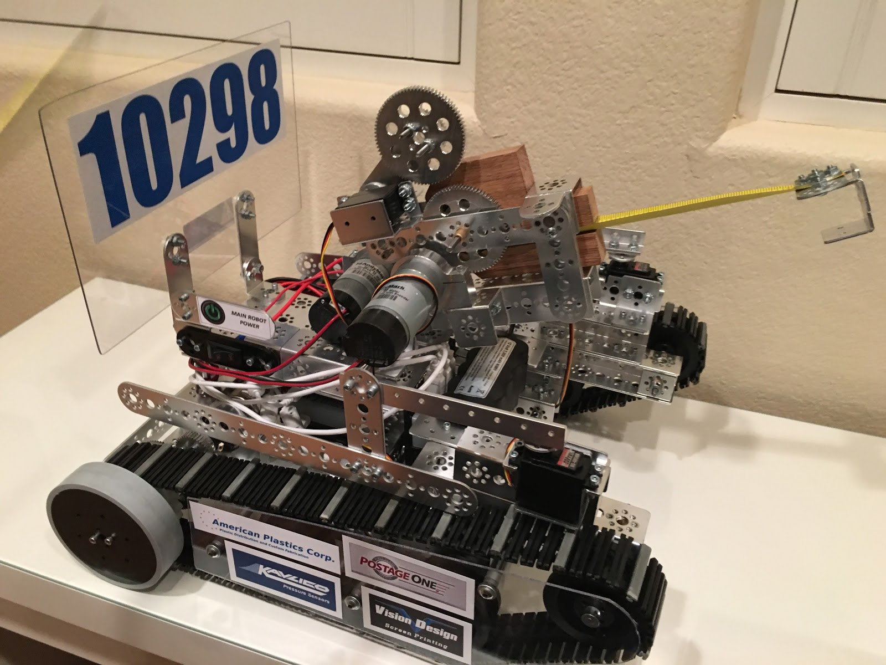

# Our Team Members - 2015-16 RES-Q Season

|  |  |
|--|--|
| Jeff DeVico | Sung Choi |
| Team role: Coach | Team role: Coach | 
| Favorite food: Fondue | Favorite food: Asian Confusion |
| Jeff has been coaching in FIRST for three years, and this is his first year coaching an FTC team. Jeff has been the owner of a growing automated shipping business for the past 11 years. He graduated college with a bachelor's degree in architecture from Cal Poly. Jeff is a proud husband and father of three kids. He has a strong background in sales marketing, fundraising, and business planning. Jeff is excited to be coaching Brain Stormz and looks forward to their future success. | Sung has coached FIRST teams since FTC Block Party. Sung has been a software/systems engineer for over 20 years in various industries. He has a Masters degree from USC in Electrical Engineering. He is a loving husband and father of 2 children. Sung has a strong background in Software, Systems Design and Electrical Engineering. |
|  |  |
| Daniel Peace | Noah DeVico |
| Team role: Robot Design/Building, Driver | Team role: Robot Design/Building, Driver |
| Favorite food: Fish and Chips | Favorite food: Burgers |
| Daniel Peace has always been interested in robotics and machines. This is his first year in First Tech Challenge, as a founding members. When not helping with robots, he enjoys playing basketball and volleyball, and he also plays piano. | Noah has been involved in FIRST programs since 2013. This is Noah's first year on a FTC team, having completed two years prior of FLL with The B.E.S.T Team. Noah is part of Trinity Pacific Christian School, which is a private school in Thousand Oaks, California. He is heavily involved in basketball at his school having played since he was ten. In his free time he likes to play his collection of vintage video games including a Sega Genesis and a Nintendo Entertainment System. Noah has liked engineering since he was little, having been a fan of Lego/Mindstorms since he was 7. |
|  |  |
| Nathan Choi | Skyler Ray Atchison |
| Team role: Robot Design/Building, Programming, Rulebook Clarifier | Team role: Document Proofreader, Website Manager, Robot Designer |
| Favorite food: Shin Ramen | Favorite food: Burritos |
| Nathan Choi is a 16 year nerd who goes to Trinity Pacific School. He was a member of FTC Trinity Crown Bots when he was a 6th grader. After that, he joined the FLL team, The B.E.S.T. Team, and is now a funding member of Brain Stormz. Nathan enjoys reading, playing with Legos, and playing video games. He is excited for Res-Q, and is ready for a great season. | Skyler Atchison is a 14-year-old homeschooled roboticist. He has been with the team for three years and is excited to be doing FTC. His other interests include mime, reading, writing, video games, board games, and video production. He prides himself on being able to pronounce Pneumonoultramicroscopicsilicovolcanoconiosis... and even if he isn't pronouncing it right, nobody can prove him wrong. |

-------------------------------------------------
# Our Story - 2015-16 RES-Q Season

#### The End of FLL Year 2

Brain Stormz began as a seven-member FLL team called the B.E.S.T. team (Building Excellent Structures Together). As we planned for our next year, we were faced with a challenge- two of our members were moving into high school, and more than half of our team members were done with FIRST programs. We had a difficult decision to make: Stay in FLL one more year now that we had more experience, or move on to the next level with less than half of our original team. As a team, we resolved to move on and face FTC. It wasn't a complete jump in the dark- one of our team members from BEST had been in a different FTC team before, and a friend from an engineering club joined our team for the FTC year. Our first meetings as a team were before we even knew what the challenge was. We planned, prepared, discussed, fundraised, and had a pool party!

#### The Beginning of the Challenge

Finally the long awaited day came. The six of us (four students, plus the coaches) traveled to the kickoff and were amazed at this new challenge. When we saw that our robot had to hang on a bar, we all exclaimed (inwardly or outwardly)- partially in shock, partially in worry, but mainly just because it would be really awesome when we accomplished that.

The year started out with fundraising and business planning. We were diligent with it, but we were waiting expectantly for the robot parts. Raising money was an extremely slow process! We sent emails to about a hundred different robotics and engineering businesses and only got a couple replies- mainly, 'We would like more information' and 'We cannot give out sponsorships at this time'. And there was another issue! To receive many potential donations, we needed a nonprofit organization- something which we could not get easily.

Our planning for the robot was pretty vague. We weren't sure what the new non-lego systems could do, or what wheels were best for getting up ramps, or what arm attachments could support a dangling robot.

#### Working with the Robot

After our Tetrix parts were received we immediately put our fundraising on hold to experiment with the robot. The first thing we built was PushBot (the five-minute bot that takes five hours to build), and we decided to use it as the base for our competition robot. That turned out to be a bad idea, but it was a start.

|  |
|--|
| 11/21/2015- Modified PushBot |
| Our first design was a variation of PushBot, a basic robot built from instructions on the FIRST website. Key points are the wood base, the monstrous useless arm, and loose wheels that couldn't do much. We made no progress up the mountain with this one, for obvious reasons. |

After the initial experimentation was done, our team split its time and energy between fundraising, engineering notebook work, and work on the robot. Almost all of our meetings (except for the pool party) were at the DeVico's house in Camarillo, for a few reasons: 1. The house is at the midpoint of all our houses. 2. We met mainly at that house while we were an FLL team. 3. They were willing to use it!

Most meetings work like this: We have approximate times for our members to arrive and leave. We decide what to work on- most of the time we just continue where we left off last meeting- and we split up to progress. The robot process went slowly- we completely destroyed our design and started from scratch halfway through the year. Even worse, the treads- the parts that we really needed- were back-ordered, and we weren't sure they would arrive in time. But we got them eventually, and we worked harder than ever to design a workable model before the competition. As we got closer and closer to the deadline, we became more determined.

|  |  |
|--|--|
| 12/3/2015- Six-Wheeled Monstrosity | 12/13/2015- MiniBot
| We had expected treads by this time, but they were back-ordered. This was our pitiful attempt at fixing that- two extra wheels. It was still too top heavy to make it onto the ramp. At least we held the electronics better with this one. | We visited another team and got some better ideas about our design. After doing some planning, we took apart our old robot and created a new base- all metal, sturdy, and ready to add more attachments. The robot made it higher up the mountain than ever before, which was another indication that we needed balanced weight to succeed. |
|  |  |
| 12/16/2015- The Heavy-Weight | 12/19/2015- Tread Boss |
| We had our base; the next step was to add an arm that ran on rack-and-pinion. And so we did. But the design wasn't quite right yet... it was too heavy to make it up the mountain, and we weren't sure the arm would work even if we did. Another problem is that the wires got tangled up. | We finally got our treads! We could make it part of the way up the mountain, but it always kept flipping over. We needed a better arm design... something that was strong enough to lift the robot, yet light and compact enough that it wouldn't hinder our mountain climbing. (Also notice the zip-ties keeping our wires together) |

#### The Final Days

Christmas Break was over. It was only a few weeks until the first competition- but our robot just would not work! What were missing? During the final days before the competition, our meetings got longer and longer- stretching from two meetings a week to three and then four! With one meeting, our members arrived a few hours after lunch and stayed till way after dinner- but we had to get everything done! This time was stressful, but we finally found the answer to making the robot work- using a tape measure to pull up our robot.

|  |
|--|
| 1/15/2016- Tread Boss v2.0 (Now climbs mountains!) A.K.A. The Tumbler |
| We used a completely different method to climb up the mountain- a tape measure. It's strong, durable, light and slim, and (most importantly) it works! It's amazing! It also has two attachments for flipping switches, a bumper for pushing obstacles, two wheels in the back to help it get over the bars, and various stability improvements. |

#### The Qualification

Finally, we arrived at the qualifying tournament. We set up our table, passed out some bracelets, and went scouting. We were in the first round of the day, and it was horrible. After driving for a while in autonomous, our robot lost connection and was completely frozen during driver control. Luckily for us, none of the other teams did much better and our alliance still managed to get first!

Our team made it slowly through the day. Our robot performed spectacularly. Our whole team cheered when it pulled itself up on the bar time after time! Of course, there were always mistakes. The robot lost connection, or dropped a part, or got stuck. There was one extremely stressful moment when our driver was about to touch the top pole before the endgame! Luckily he realized just in time and we barely missed a huge penalty.

Then it was time for alliance selection. We were in fifth, and the first four teams got to pick their alliance partner. Before the selection, our team had a private meeting outside. The question was- What alliance partner would be best for us? There was still a chance that we could pick, and it would tell us where to focus our scouting. We had decided that of all the other first place teams, 'the Ducks' would be best for us. They had a good record, and they were focused on collecting debris rather than doing a pull-up, meaning they would be a good compliment to us. So we went in and talked to the different first place teams- all the while looking at 'the Ducks'. Would they pick us? Or would we get stuck with a less-than-ideal team?

When the time came, we choose Noah as our representative and sat in the stands with our fingers crossed. 'The Ducks' got to choose first. Their representative stepped up to the mic, gazed around the room, and announced, "Team #8471, 'The Ducks', graciously asks Team #10298, 'Brain Stormz,' to be their alliance partner."

We were in! As soon as the ceremony was done, we hurried over to a table to begin strategy. We were nervous- 'The Ducks' were a veteran, victorious team, with about ten members and a record of huge awards- First Place Inspire, First Place Robotics Competition, they were the best of the best! And we were only a rookie team, with four guys, at our first ever tournament. What if our robot failed? What if we let this veteran team down? We would be lucky if any first place team ever picked us again!

Our first round confirmed our fears. Our robot's connection glitched out again! 'The Ducks' were kind about it- they helped us fix our robot and gave us some suggestions for the next round. But we resolved not to make the same mistake again! We barely made it through the semifinals, and then the finals. The timer counted down, and our robot did it! We won the finals - we had won the tournament, and it was awesome! Besides the big win, we also got awards for 2nd Place Inspire (incidentally, 1st place went to 'the Ducks') and 1st Place Robot Design.

#### The second qualifier

We went to the next tournament with minimal changes to the robot, but with high hopes for placing high in the rankings. After many successful matches, we placed in the top 4 for the semifinals of the match. We decided, since we had already qualified the the regional competition at the last tournament, to bring along a rookie team who had not qualified yet, since we did not need to place in the top 8 in this match to move on. Unfortunately, this led to us being eliminated in the semifinals.

#### Moving on to the regional competition

| 2/xx/2016- The Unicorn ResQer |
|--|
| We ran into a problem at our second tournament- our switch-flipping attachments were not strong enough to activate the levers. We fixed it by putting the servos at a different angle and putting a shield around the bars. Another addition was a one-way hinge in the back that would protect electrical components from debris (in one round the debris detached a wire and shut down the entire robot) but bends out of the way when our robot goes up the bars. Also note that we used plastic for our tape measure holder rather than wood (which kept breaking apart); we included a 'unicorn horn' to hold the climbers and drop them into the basket; we added omni-wheels to allow the robot to turn better, and we added a mechanism to activate the all clear signal at the top of the mountain. |

Going into regionals, we had completely redesigned our robot lifter housing to use Velcro. This eliminated some issues we were having with the tape measure binding. We also added an arm to activate the flag at the top of the mountain. We did well throughout the day of tournament, and we placed 6th overall going into semifinals. We picked two teams for our alliance partners, but ended up loosing in the quarterfinals, do to accidentally driving too far up the mountain before latching on, and thus tumbling down the mountain. Because of this, we unfortunately did not make it to the super-regional competition.  All in all though, this was an amazing first season as an FTC team!

## Sponsors:

